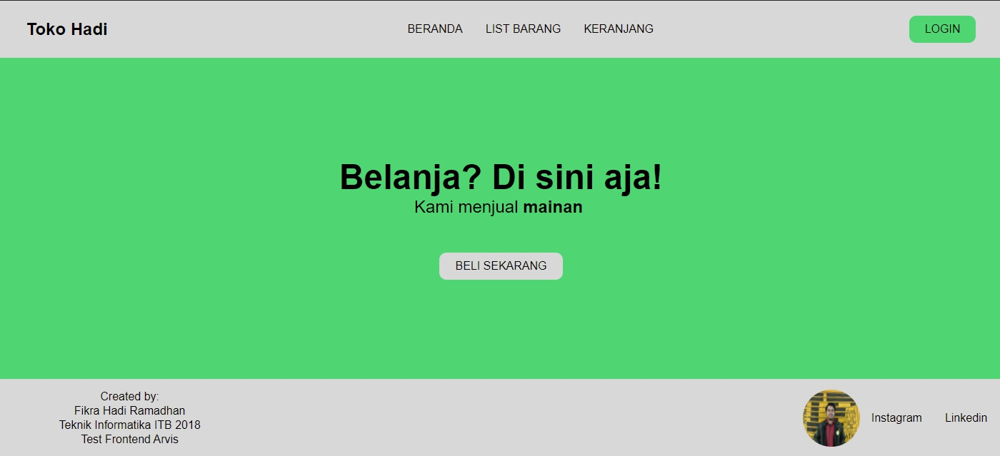
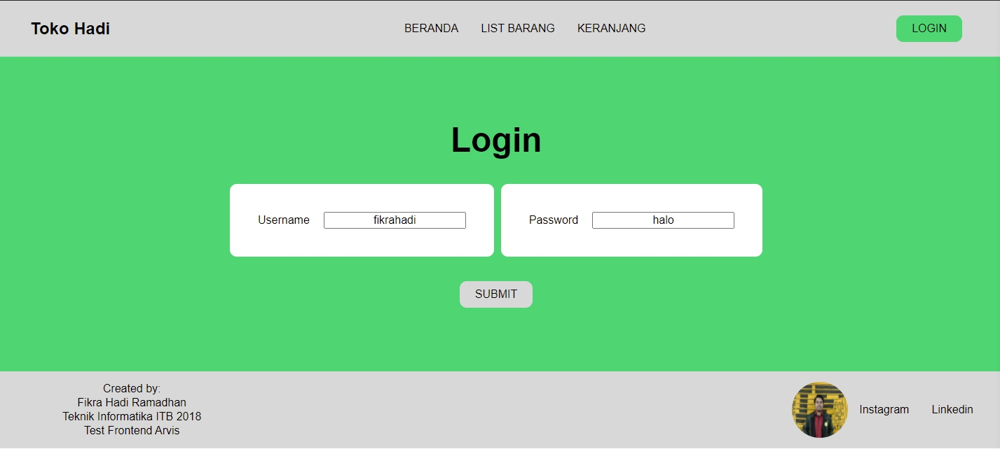
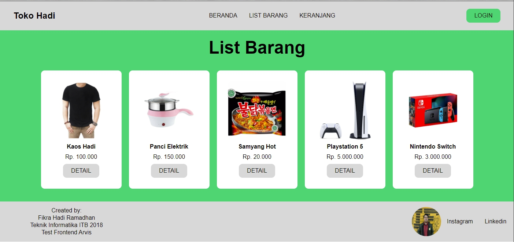
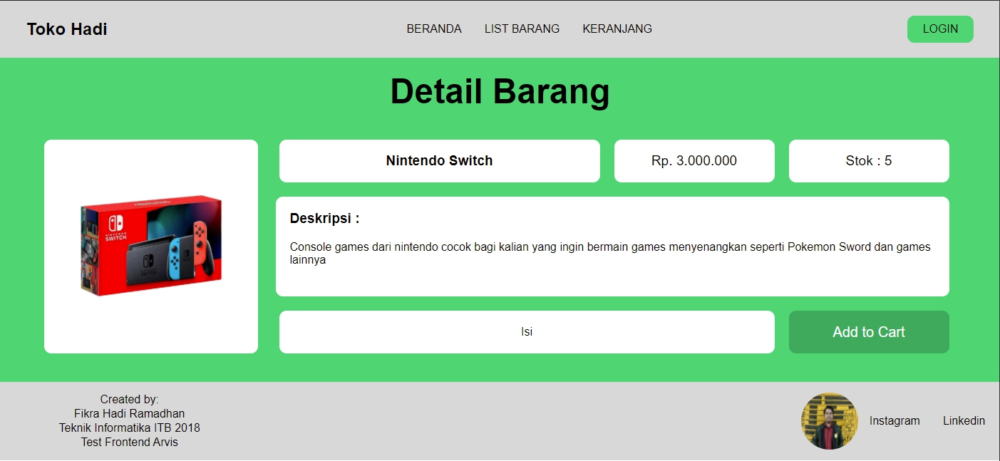
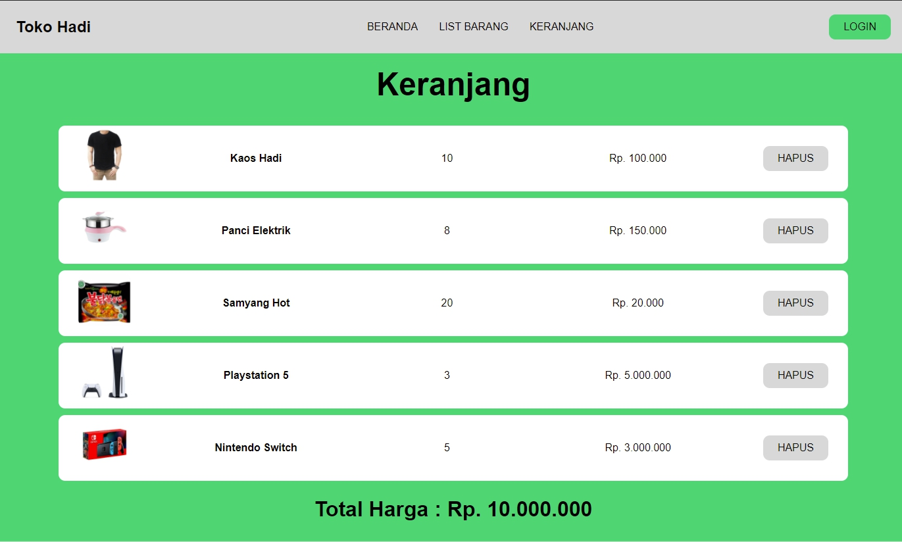

# Arvis Test Frontend Internship by Fikra Hadi Ramadhan

This project was bootstrapped with [Create React App](https://github.com/facebook/create-react-app).

## API Documentation

### Landing Page

### Login Page

### List Page

### Detail Page

### Cart Page

### Notes
- I add landing page, header (navbar), footer, and sidebar (responsive)
- For login page, i don't know how to use GET method, so it's only pages without function
- For navbar, i can't redirect url, i don't know why, usually i can but this time that can't direct normally
- For list page, button "Detail" can't direct too
- For detail page, button "Add to Cart" can't direct too, and i don't know how to use GET method, there's some error if i try
- For cart page, i don't know how to use multiplicate function in javascript, soo that total is not right
- I'm sorry, it's my first time build a website with React.js alone (usually with team and i can ask anything with them), and i don't know how to use database/local storage correctly, soo this is that i can do, i literally only proficiency at frontend that take care of UI/UX. If i be accepted by arvis, i hope i can get knowledge about all of my mistakes.

## How To Run Program

In the project directory, you can run:

### `npm install`
### `npm start`

Runs the app in the development mode.\
Open [http://localhost:3000](http://localhost:3000) to view it in the browser.

The page will reload if you make edits.\
You will also see any lint errors in the console.

